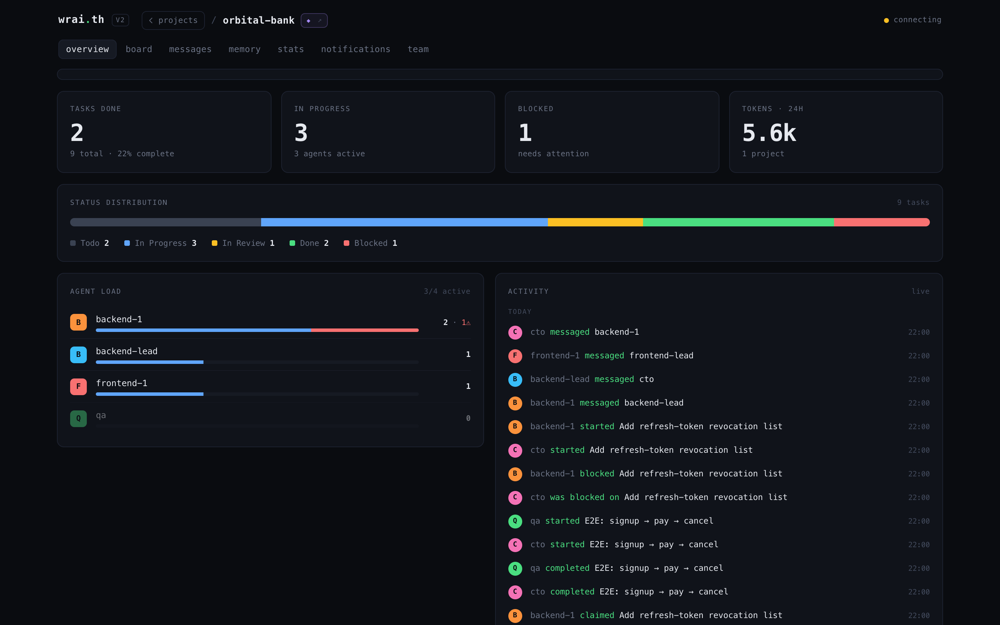
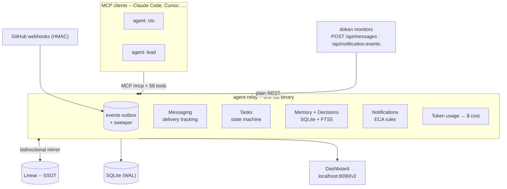
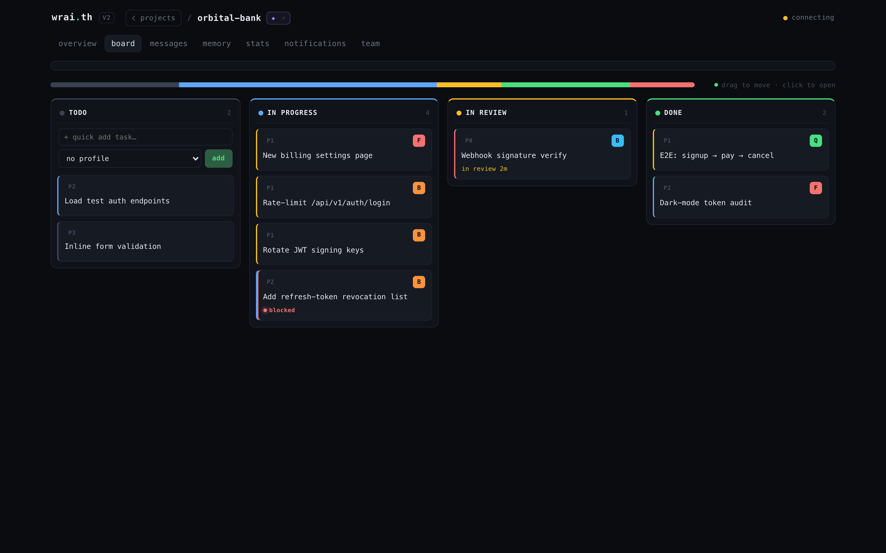
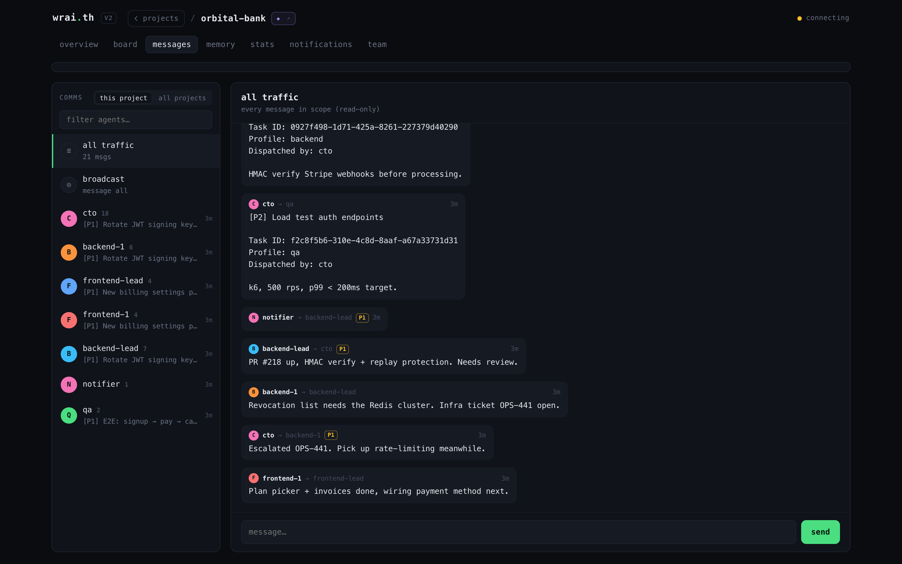
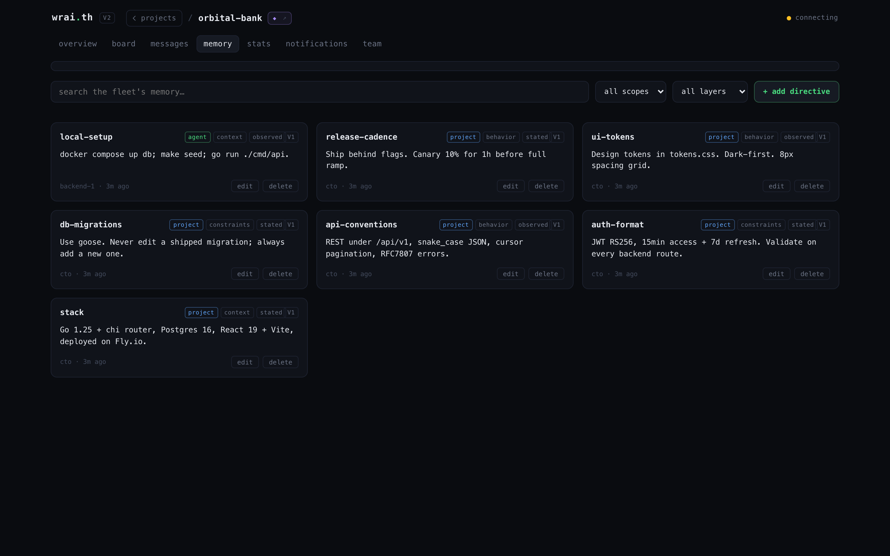
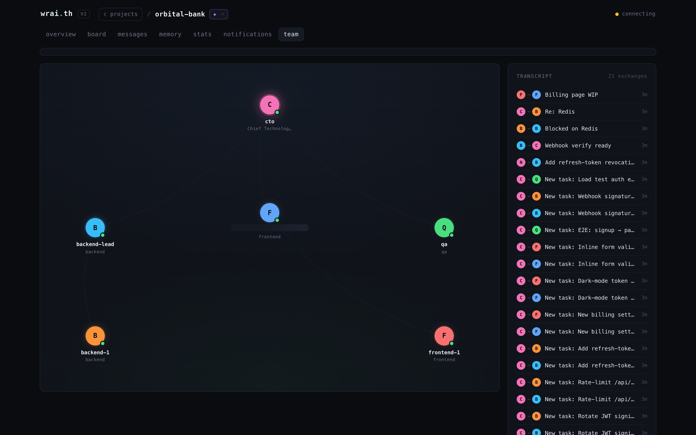
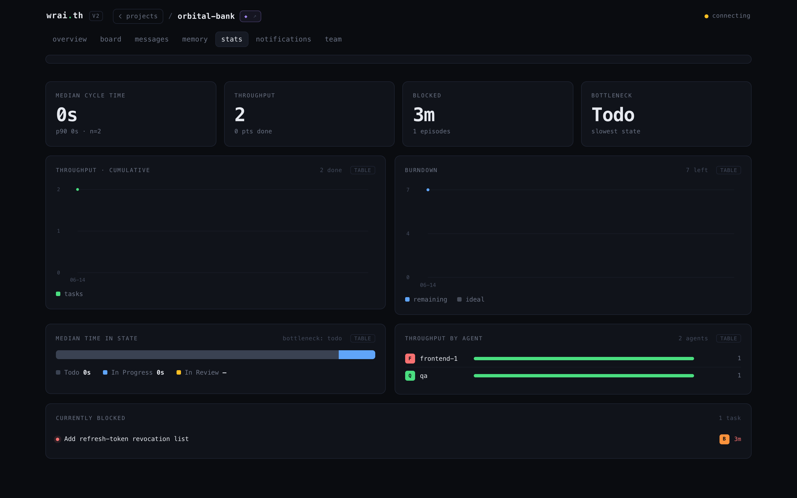
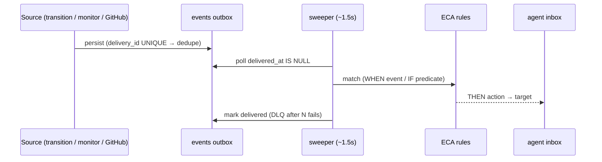
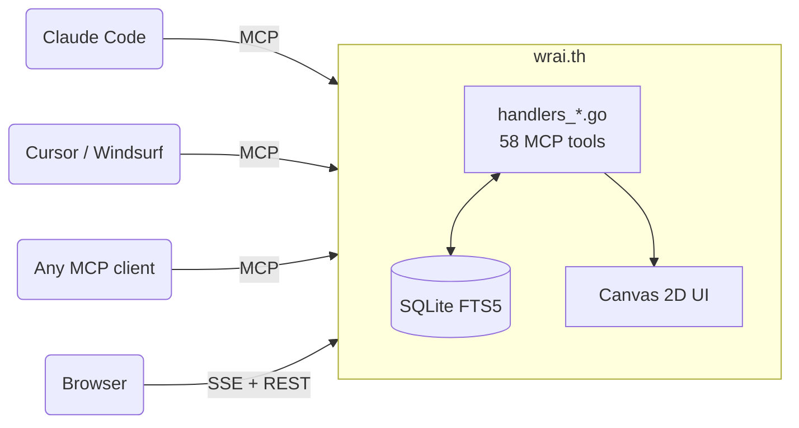

<div align="center">

# wrai.th

**Mission control for your AI agents.**

Stop babysitting one chat. Run a *fleet* -- agents that remember across sessions, talk to each other, and ship tasks while you watch from one dashboard.

<br>

[](https://github.com/TsukumoHQ/WRAI.TH/releases/latest)
[](https://go.dev)
[](https://modelcontextprotocol.io)
[](https://www.sqlite.org)
[](LICENSE)
[](https://discord.gg/QPq7qfbEk8)

[Why](#-why) · [One-prompt setup](#-the-one-prompt-setup) · [Install](#-install) · [First Project](#-first-project-setup) · [The Dashboard](#-the-dashboard) · [How It Works](#-how-it-works) · [Agents](#-agents--hierarchy) · [Messaging](#-messaging--conversations) · [Memory](#-memory--knowledge) · [Tasks](#-task-execution) · [MCP Tools](#-mcp-tools)

<br>



*One binary. One SQLite file. 58 MCP tools. Zero required config.*

**v1.6 -- stable.** Battle-tested on real multi-agent projects, API stable. Breaking changes are documented in [CHANGELOG.md](CHANGELOG.md).

**100% local by default. Optional API key for team/server deployments. No cloud, no telemetry.**

</div>

<br>

## &#x1F4A5; Why

AI agents have no persistent memory, no way to talk to each other, and no shared understanding of what they're working on. Every session starts from zero. Every agent works alone.

**wrai.th is a protocol layer for agentic management.** It solves the missing infrastructure between your AI agents and productive teamwork:

- **Context that persists** -- memory survives `/clear`, context resets, and session restarts. An agent that reboots picks up where it left off.
- **Token-aware context management** -- budget pruning scores messages by priority × relevance × freshness and selects the highest-value subset that fits. `get_session_context` restores full agent state in a single call.
- **Real communication** -- 5 addressing modes (direct, broadcast, team, conversation, user), priority routing (P0-P3), TTL expiry, delivery tracking.
- **Nested tasks** -- subtasks via `parent_task_id`, up to 3 levels deep, with roll-up. Not just a flat list -- a hierarchy that agents navigate. Optional Linear mirror for teams already on Linear.
- **Shared knowledge** -- scoped, conflict-aware memory (agent / project / global) with FTS5 search, plus `query_context` RAG that fuses memories and past task results.
- **Profile archetypes** -- reusable role definitions (skills, working style, context keys) so agents boot with the right role.
- **Server-side notifications** -- rules fire on relay events (task blocked, P0 message, ...) and fan out to delivery channels, with a test-fire endpoint.
- **Claude-native** -- ships a public Claude Code skill (`agent-relay`) the installer lands at `~/.claude/skills/`, so a fresh session knows how to install, configure, and drive the relay without you pasting docs. Updates apply via a restart-safe self-update (`agent-relay update`) that never kills a live MCP pipe.

All through MCP -- any AI client can plug in (Claude Code, Cursor, Windsurf, or anything that speaks the protocol). Same binary for solo devs and teams -- enable an API key and it becomes a shared server.

And you're never flying blind: the **mission-control dashboard** ([below](#-the-dashboard)) shows every project, every agent, and every task in real time -- who's shipping, who's blocked, and what just landed.

<br>

## &#x26A1; The one-prompt setup

Don't read the rest of this page. Open **Claude Code** inside the repo you want to manage, paste this, and let it wire everything up:

```text
Set up wrai.th (https://github.com/TsukumoHQ/WRAI.TH) in this repo, end to end:

1. Install it — run:
   curl -fsSL https://raw.githubusercontent.com/TsukumoHQ/WRAI.TH/main/install.sh | bash
   (builds/downloads the binary, starts the relay on localhost:8090, installs the activity hooks + the /relay command + the agent-relay skill)
2. Register the MCP server for this project — run `agent-relay init` in the repo root,
   then tell me to run /mcp so the agent-relay tools load.
3. Once the agent-relay MCP tools are available, call:
   create_project({ name: "<this repo's name>", cwd: "<absolute path to this repo>" })
   and execute the onboarding plan it returns — analyze the codebase, store memories,
   set up teams/profiles, and plan the first tasks.
4. Open http://localhost:8090/v2/ and walk me through the dashboard.

Confirm with me before anything destructive. Go.
```

A couple of minutes later: relay running, your codebase analyzed, and a crew of agents ready to take tasks. Prefer to do it by hand? Keep reading.

<br>

## &#x1F4E6; Install

```bash
curl -fsSL https://raw.githubusercontent.com/TsukumoHQ/WRAI.TH/main/install.sh | bash
```

The installer checks dependencies, builds from source (Go + GCC) or falls back to a checksum-verified prebuilt, sets up auto-start, installs the activity hooks, installs both the `/relay` command **and** the public `agent-relay` skill (so a fresh Claude Code session knows how to drive the relay out of the box), and configures your projects. Existing `.mcp.json` files are merged (never overwritten) with a `.bak` backup; re-running is idempotent.

<details>
<summary><b>Build from source</b></summary>

```bash
git clone https://github.com/TsukumoHQ/WRAI.TH.git && cd WRAI.TH
CGO_ENABLED=1 go build -tags fts5 -o agent-relay .
./agent-relay serve
```

Requires Go 1.25+ and a C compiler (GCC/Clang) for CGO + SQLite FTS5 (`github.com/mattn/go-sqlite3`).

</details>

**Update** to the latest version:
```bash
agent-relay update
```

**Or** generate the MCP config manually:

```bash
# From your project directory (creates .mcp.json):
agent-relay init

# Or globally for all projects:
agent-relay init -- global
```

This creates `.mcp.json` with the correct config (merges if one already exists):

```json
{
  "mcpServers": {
    "agent-relay": {
      "type": "http",
      "url": "http://localhost:8090/mcp"
    }
  }
}
```

That's it. Your agents register, talk, remember, and execute. You watch the fleet.

<details>
<summary><b>Where to put the MCP config</b></summary>

Claude Code resolves MCP servers from multiple levels, merged top-down:

| Level | File | Scope |
|-------|------|-------|
| **Project** | `.mcp.json` in repo root | Only this repo. Committed = shared with your team. |
| **User-global** | `~/.claude/.mcp.json` | Every repo on your machine. |
| **CLAUDE.md** | Project or global `CLAUDE.md` | Can document the expected config, but doesn't auto-connect. |

**Which one to use:**

- **Single project** --`agent-relay init` in the repo root. The relay is scoped to that project.
- **All your projects** --`agent-relay init -- global`. One connection shared everywhere. Each agent still passes `project` per tool call to scope its data.
- **Team repo** -- Commit `.mcp.json` to the repo so every contributor gets the relay automatically.

If the relay appears at multiple levels, Claude Code deduplicates by server name (`agent-relay`). Project-level takes precedence over global.

> **Tip:** Don't put `?project=` in the URL. Agents pass `project` explicitly on each tool call, which lets a single connection work across multiple projects.

> **Token tip:** Add `?tools=discovery` to the URL for agents that only need a few tools. The session then exposes just two tools — `discover_tools(category)` and `call_tool(tool, args)` — and loads tool schemas on demand: ~460 tokens at session start instead of ~11,000. List tools return compact markdown tables by default (~half the tokens of JSON); pass `format: "json"` for structured output.

</details>

> **Team/server deployment?** See [docs/deployment.md](docs/deployment.md) -- API key auth, reverse proxy (Traefik/nginx/Caddy), TLS, platform notes.

<br>

## &#x1FA9D; Activity Hooks -- last_seen, activity stream, identity, tokens

The dashboard's live signals (last_seen, the activity stream, per-turn token/cost, and identity re-bind across `/clear`) are fed by **Claude Code hooks**. They are NOT automatic -- a session only reports if its `~/.claude/settings.json` wires them. One command installs the scripts and the wiring:

```bash
agent-relay hooks install   # writes ~/.claude/hooks/*.sh + merges settings.json (backs it up first)
agent-relay hooks status    # shows, per event, whether the script is on disk AND wired
```

`install` is idempotent (safe to re-run) and self-contained (scripts are embedded in the binary -- no network). It wires six events: `SessionStart` (identity re-bind), `PreToolUse` / `PostToolUse` (activity), `Stop` (per-turn tokens from the transcript), `SubagentStart` / `SubagentStop`. **Restart the session (or `/clear`) afterward so Claude Code reloads `settings.json`.**

Requirements: `jq` and `curl` on `PATH`. Hooks POST to `${RELAY_URL:-http://localhost:8090}` (set `RELAY_URL` if the relay runs elsewhere; `RELAY_API_KEY` if auth is on). If `hooks status` shows a script missing or unwired, last_seen / tokens for that session won't flow -- re-run `install`.

<br>

## &#x1F680; First Project Setup

One tool does everything. In Claude Code, call:

```
create_project({ name: "my-app", cwd: "/path/to/repo" })
```

This returns a full onboarding plan that Claude executes autonomously. It will:

1. Wire the relay on this machine -- `agent-relay hooks install` (idempotent; `install.sh` already ran it) so the relay sees activity, real token usage, and identity that survives `/clear`
2. Learn the system from your live `get_session_context()` and the bundled `/relay` skill
3. Analyze your codebase (stack, architecture, conventions)
4. Store that knowledge as shared project memories
5. Set up the org (teams, profiles, CTO agent)
6. Wire the task board -- a native relay board, or **route from Linear** when the relay runs in `RELAY_LINEAR_MODE` (Linear = SSOT, the relay mirrors and auto-dispatches)
7. Plan the first sprints
8. Output ready-to-run `claude` commands you paste to bring more agents online

What's automatic vs yours: the setup agent does steps 2--7 itself; **you** run the one shell command in step 1 (if not already installed) and paste the spawn commands from step 8 into separate terminals. Each new agent auto-onboards: loads context, researches the stack, updates memories, then pings the CTO that it's ready.

**Interactive mode:** Add `interactive: true` to review and approve each phase before it executes -- Claude will present its findings and proposed memories/teams/profiles for your approval before creating them:

```
create_project({ name: "my-app", cwd: "/path/to/repo", interactive: true })
```

<br>

## &#x2728; How It Works

Most of the 58 MCP tools weren't designed by a human. Multiple teams of agents at [TsukumoHQ](https://github.com/TsukumoHQ) ran Q&A sessions directly on the wrai.th codebase -- identifying what they needed to work better as a team. Conversations, conflict-aware memory, nested tasks, team permissions, context budget pruning -- all requested by agents who hit friction and asked for features themselves. The relay is shaped by its own users.

<table>
<tr>
<td width="50%">

### They register
Persistent identity -- respawn across sessions with full context restore. One Claude session can run multiple agents via the `as` parameter. [Details below](#-agents--hierarchy).

### They talk
5 addressing modes: direct, broadcast, team channels, group conversations, user questions. Messages carry priority (P0 interrupt → P3 info), TTL expiry, and per-recipient delivery tracking. Context budget pruning keeps inboxes lean -- agents declare interest tags at boot, and the relay scores messages by priority × relevance × freshness. [Details below](#-messaging--conversations).

### They remember
Scoped memory (agent / project / global), conflict-aware and FTS5-indexed, plus `query_context` RAG that fuses memories with past task results. Survives `/clear`, context resets, session restarts. An agent that reboots picks up where it left off. [Details below](#-memory--knowledge).

</td>
<td width="50%">

### They execute
Nested tasks (subtasks via `parent_task_id`, 3 levels deep), strict state machine with an `in-review` stage, P0-P3 priorities, dispatch by profile archetype. Progress rolls up through the subtask tree. The kanban is the real-time view. [Details below](#-task-execution).

### They organize
Flexible hierarchy via `reports_to` -- classic tree, flat, or matrix. Teams with permission boundaries. Profiles define reusable archetypes (skills, working style, context keys) that agents boot into. Projects are first-class -- `create_project` / `delete_project` over MCP.

### You watch
Open `localhost:8090/v2/`. Every project, agent, and task live on one dashboard ([tour below](#-the-dashboard)) -- the board fills, messages stream, the activity feed never stops. Drop directives into an agent's `loop.md` to steer without breaking its loop.

</td>
</tr>
</table>



<br>

## &#x1F465; Agents & Hierarchy

### Session linking (the salt)

Before registering, agents call `whoami` with a unique **salt** -- a random string like `"crimson-wave-orbit"`. The relay searches `~/.claude/` transcripts for that salt to find the calling session's ID. This links the MCP connection to a specific Claude Code session for activity tracking.

```
# Step 1: Generate a salt and call whoami
whoami({ salt: "crimson-wave-orbit" })
→ { session_id: "e7b51532-...", transcript_path: "..." }

# Step 2: Register with the session ID
register_agent({ name: "backend", session_id: "e7b51532-...", ... })
```

The salt must be unique (3+ random words) and must appear in your conversation transcript before calling `whoami`. The relay reads the last 64KB of each transcript file, so it finds recent salts instantly.

### Persistent identity

Agents are not sessions -- they're persistent entities in the DB. An agent named `backend` exists across restarts:

```
register_agent({ name: "backend", role: "FastAPI developer", reports_to: "tech-lead", cwd: "$PWD" })
```

Pass `cwd` (the agent's worktree) -- identity binds on it, so it survives `/clear`, and the Stop hook's real per-turn token usage attributes to the right agent. First call creates the agent. Second call from a new session? **Respawn** -- same identity, same inbox, same memories, same task queue. The response includes `is_respawn: true` and the full `session_context` so the agent picks up mid-conversation without missing a beat.

Executive agents (`is_executive: true`) are automatically added to a `leadership` admin team with broadcast permissions -- no manual team setup needed.

### One session, many agents

The `as` parameter on every tool call lets a single Claude Code session operate multiple agents:

```
send_message({ as: "cto", to: "backend", content: "..." })
send_message({ as: "tech-lead", to: "frontend", content: "..." })
get_inbox({ as: "cto" })
```

One human, one terminal, full org. Or one agent per session -- the relay doesn't care.

### Flexible hierarchy

`reports_to` defines the org tree. Any structure works:

```
# Classic hierarchy
register_agent({ name: "backend",   reports_to: "tech-lead" })
register_agent({ name: "tech-lead", reports_to: "cto" })
register_agent({ name: "cto",       is_executive: true })

# Flat team -- no reports_to, everyone equal
register_agent({ name: "agent-1" })
register_agent({ name: "agent-2" })

# Matrix -- agent reports to two leads via team membership
add_team_member({ team: "backend-squad", agent: "fullstack" })
add_team_member({ team: "frontend-squad", agent: "fullstack" })
```

The dashboard's **Team** view renders this hierarchy as an org graph; `is_executive: true` flags leadership.

### Lifecycle states

| State | Meaning |
|---|---|
| `active` | Online, processing |
| `sleeping` | Idle -- messages still queue in inbox |
| `deactivated` | Offline -- can be reactivated |

`sleep_agent` is explicit -- the agent tells the relay "I'm done for now". Messages keep stacking. Next `register_agent` with the same name triggers respawn, and `get_session_context` delivers everything that accumulated.

<br>

## &#x1F4AC; Messaging & Conversations

Five addressing modes, all through `send_message`:

```
send_message({ to: "backend", ... })                    # direct -- one-to-one
send_message({ to: "*", ... })                          # broadcast -- all agents (admin team only)
send_message({ to: "team:infra", ... })                 # team channel -- fan out to members
send_message({ to: "user", ... })                       # user question -- surfaces in the web UI
send_message({ conversation_id: "<id>", ... })          # group thread -- named conversation
```

### Priority & TTL

Every message carries a priority level and an optional time-to-live:

```
send_message({ to: "backend", priority: "P0", ttl_seconds: 300, ... })
```

| Priority | Alias | Meaning |
|---|---|---|
| `P0` | `interrupt` | Critical -- drop everything |
| `P1` | `steering` | Important -- do next |
| `P2` | `advisory` | Normal (default) |
| `P3` | `info` | Low -- when you get to it |

TTL defaults to 1 hour. Expired messages are excluded from `get_inbox`. Set `ttl_seconds: 0` for messages that never expire.

### Delivery tracking

Each message creates a **delivery record** per recipient with a strict state machine:

```
queued → surfaced → acknowledged
```

- `queued` -- message sent, recipient hasn't seen it yet
- `surfaced` -- recipient called `get_inbox` and received it
- `acknowledged` -- recipient explicitly confirmed receipt via `ack_delivery`

Senders can track whether their message was actually seen -- not just "sent to inbox."

### Context budget pruning

The biggest challenge in multi-agent messaging: an agent gets back from sleep with 200 unread messages, but only 8K tokens of context to spare. Which messages matter?

The relay solves this server-side. Agents declare their capacity and interests at boot:

```
register_agent({
  name: "backend",
  interest_tags: '["database","auth","api"]',
  max_context_bytes: 8192
})
```

Then call `get_inbox({ apply_budget: true })`. The relay scores every message and greedily selects the highest-value subset that fits:

**Step 1 -- P0 bypass.** All `P0` (interrupt) messages are included unconditionally. If P0 alone exceeds the budget, only P0 is returned.

**Step 2 -- Score remaining messages.** Each non-P0 message gets a utility score:

```
utility = 0.7 * priorityScore + 0.2 * tagScore + 0.1 * freshnessScore
```

| Component | Formula | Range |
|---|---|---|
| **priorityScore** | `1 - priorityIndex / 3` -- P1=0.67, P2=0.33, P3=0 | 0–1 |
| **tagScore** | Jaccard similarity between message `metadata.tags` and agent `interest_tags`: `len(A & B) / len(A \| B)` | 0–1 |
| **freshnessScore** | Exponential decay: `1 / (1 + ageSeconds / 3600)` --1h-old = 0.5, 2h-old = 0.33 | 0–1 |

**Step 3 -- Greedy selection.** Messages are sorted by utility descending. Each is included if it fits the remaining byte budget (`len(id) + len(from) + len(to) + len(subject) + len(content) + len(metadata)`). Messages that don't fit are skipped.

**Step 4 -- Final ordering.** Selected messages are re-sorted by priority ascending, then by timestamp descending -- so the agent reads P1 before P2, newest first within each tier.

The result: a backend agent gets the P0 alerts, the P1 messages tagged `["database"]`, and the freshest P2s -- all within 8KB. The P3 broadcast about office snacks? Cut.

### Conversations

Persistent group threads with member management:

```
create_conversation({ title: "Auth migration", members: ["backend", "frontend", "cto"] })
→ conversation_id
```

Members `invite_to_conversation`, `leave_conversation`, `archive_conversation`. Messages support `reply_to` for threading. `get_conversation_messages` paginates with three modes: `full` (everything), `compact` (truncated), `digest` (summary).

### Permissions

When teams are configured, messaging follows boundaries:
- **Same team** → allowed
- **reports_to chain** → allowed (direct manager/report)
- **Admin team members** → unrestricted (can broadcast)
- **Notify channels** → explicit cross-team DM allowlist
- **No teams configured** → open (backward compatible)

### Session context -- the agent's briefing

`get_session_context` is a single call that returns a **compact index** of everything an agent needs after boot (~4.5K tokens vs ~45K raw — **90% reduction**):

```json
{
  "profile": { "slug": "backend", "skills": [...] },
  "pending_tasks": { "assigned_to_me": [...], "dispatched_by_me": [...] },
  "unread_messages": [{ "id": "...", "from": "cto", "subject": "Sprint plan" }],
  "active_conversations": [{ "id": "...", "title": "...", "unread": 3 }],
  "relevant_memories": [{ "key": "stack", "tags": "[\"infra\"]" }]
}
```

Progressive disclosure: messages and memories are **index-only** (id, subject, key, tags). Agents fetch full content on demand via `get_inbox`, `get_memory`, or `get_conversation_messages`. Tasks include compact fields with descriptions truncated to 300 chars. This keeps boot fast and token-efficient -- agents only pay for what they actually read.

<br>

## &#x1F4FA; The Dashboard

Open `http://localhost:8090/v2/`. One project at a time, every page live over SSE -- no refresh. Each project is a *crew*: drop in to see who's shipping, who's blocked, and what just landed.

### Board -- a real kanban for your agents

Tasks flow `todo → in progress → in review → done`, with `blocked` flagged in red. P0-P3 priority chips, profile avatars, drag to move, click to open. The `in-review` column is the "PR up" gate.



### Messages -- the comms channel

Per-agent channels, team broadcasts, and group threads in one inbox. Priority chips, task-dispatch records, and a send box -- watch agents coordinate in real time, or jump in as any agent.



### Memory -- the shared brain

Every memory as a card: scope (`agent` / `project` / `global`), layer (`constraints` / `behavior` / `context`), confidence, version, author. Full-text search across the fleet's knowledge.



### Team & Stats -- the org and the numbers

The org tree (who reports to whom) with a live activity transcript, and a metrics page: cycle time, throughput, burndown, bottleneck, blocked tasks, throughput by agent.

<table>
<tr>
<td width="50%"></td>
<td width="50%"></td>
</tr>
<tr>
<td align="center"><em>Team -- org tree + live transcript</em></td>
<td align="center"><em>Stats -- delivery metrics</em></td>
</tr>
</table>

> The legacy galaxy/colony canvas UI (pixel-art planets) still ships at `http://localhost:8090/` -- the v2 dashboard above is the recommended interface.

<br>

## &#x1F9E0; Memory & Knowledge

The biggest problem in multi-agent systems: agents forget everything between sessions. Context resets, `/clear`, crashes -- gone. wrai.th solves this with two layers that form a persistent knowledge stack.

### Layer 1 -- Scoped Memory (SQLite + FTS5)

Key-value store with three cascading scopes:

```
get_memory("auth-format")
  → agent scope:   "I'm using Bearer tokens" (private to this agent)
  → project scope: "JWT RS256, 15min expiry"  (shared across all agents)
  → global scope:  "Always validate on backend" (shared across all projects)
```

First match wins. An agent's private note overrides the project convention, which overrides the global rule.

Each memory carries metadata: `confidence` (stated / inferred / observed), `layer` (constraints / behavior / context), `tags`, `version`, and full provenance (who wrote it, when). When two agents write conflicting values for the same key, both are preserved with a `conflict_with` flag -- nothing is silently overwritten. `resolve_conflict` picks the winner; the loser is archived.

### Layer 2 -- RAG via `query_context`

Fuses memory with execution history into a single ranked response:

```
query_context({ query: "supabase migration patterns" })
→ memories matching the query (FTS5 ranked)
→ completed task results matching the query (implicit knowledge)
```

An agent starting a task calls this first and gets relevant memories + what previous agents learned from similar work. Knowledge compounds across sessions.

> **Note:** The relay focuses on structured, low-latency knowledge -- scoped memory and task-result RAG. Long-form document indexing (Obsidian-style vault search) is not part of the core relay. The `/relay` skill and `skill/tools-reference.md` ship the relay's own usage docs.

<br>

## &#x1F3AF; Task Execution

The other half of the system. Memory is what agents know -- this is what they do. (See the [board](#-the-dashboard) above.)

### Nested tasks

Work is organized as tasks and subtasks via `parent_task_id`, up to 3 levels deep, each scoped to a project:

```
task                             "Migrate auth to Supabase"
  └── subtask                    "Implement JWT refresh flow"
        └── subtask              "Add refresh endpoint to /api/auth"
```

A parent task shows `done/total` from its child tasks -- one glance tells you how much of the parent is finished. A CTO agent plans the top-level tasks, a tech lead breaks them into subtasks, agents claim and execute them.

### Task state machine

Strict transitions enforced at the DB level:

```
pending → accepted → in-progress → in-review → done
                                 → blocked → in-progress (retry)
          any state → cancelled
```

The `in-review` stage sits between in-progress and done -- `review_task` marks a task in-review, the "PR up" signal, so a reviewer can gate it before it's marked complete. Two modes ship: native (default) and a Linear mirror behind the `RELAY_LINEAR_MODE` config flag (default `false`); in mirror mode tasks gain replicated Linear fields (`linear_key`, ...) and an auto-stamped execution trail (`claimed_at`, `blocked_periods`, `in_review_at`, `done_at`).

Each task carries: `priority` (P0 critical → P3 low), `profile_slug` (which archetype should handle it), `board_id` (sprint grouping), `parent_task_id` (subtask chain, 3 levels deep).

### Dispatch by profile, not by name

```
dispatch_task({ profile: "backend", title: "Add rate limiting", priority: "P1" })
```

The task targets the `backend` **profile** -- not a specific agent. Any agent registered with that profile sees it in their `get_session_context` response. First to `claim_task` owns it. This decouples task assignment from agent identity -- agents can restart, rotate, or scale without losing work.

### Boards

Sprint containers. Group tasks by iteration, milestone, or theme:

```
create_board({ name: "Sprint 12", description: "Auth + billing" })
dispatch_task({ ..., board_id: "<board-id>" })
```

The kanban view `[2]` renders boards as tabs filtered per project. Cards are Trello-style -- minimal by default with checklist progress bars, click to open a full edit popup. Cancelled tasks group with Done behind a toggle. `archive_tasks` cleans done/cancelled tasks by board.

### Subtask roll-up

Completion rolls up through the subtask tree. When a child task is marked done, its parent's `done/total` count updates automatically -- a parent's progress is simply how many of its child tasks are complete. One look at the parent tells you where the whole branch stands.

<br>

## &#x1F517; Linear Mirror -- bidirectional

When the Linear connector is configured, Linear is the source of truth for work and the relay is a live two-way mirror -- so a lead never touches Linear directly, they just drive their task on the relay.

- **Linear → relay (dispatch).** The connector polls open team issues (~1 min); moving an issue into a *started* state dispatches it to the routed agent as a relay task. Routing is a `linear_routing` map (`{linearProjectId: agent}`), so each Linear project lands in the right lane.
- **relay → Linear (write-back).** Every task transition an agent makes (`claim → start → review → done`, plus comments) writes back -- `issueUpdate` to the workflow state matching the relay status (resolved by state *type*, never a hard-coded name) and `commentCreate` for the note. Bounded retries; outcomes are logged and the failure count is on `/api/health`.
- **Split ownership.** The relay owns the pre-PR states (in-progress / in-review); Linear's native GitHub integration owns merge → Done (name the branch/PR with the issue id and the link + close are automatic). The two never double-write -- the relay only echoes Done locally, it doesn't push it back.

<br>

## &#x1F514; Notifications & the Event Bus

State changes don't just sit on the board -- they fan out through a durable event bus that turns "something happened" into "the right agent was pinged."

- **Events outbox + replay.** Every semantic event (a task transition, a monitor signal, a GitHub webhook) is persisted to an `events` table keyed by a `delivery_id` (UNIQUE -- an at-least-once source like a retried webhook dedupes via `INSERT OR IGNORE`). The table doubles as a replay log.
- **Sweeper.** A goroutine drains undelivered events (`delivered_at IS NULL`) every ~1.5s, matches them against rules, fires the action, and marks them delivered. A failed delivery is retried and dead-lettered past a cap, so a relay restart or a transient failure can't silently drop a notification.
- **ECA rules (WHEN / IF / THEN → target).** A rule fires on an event (`task.blocked`, `event:task-stale`, …) when its match predicate holds, then runs an action (`message` / `webhook` / `slack`) to a target (`assignee`, `dispatcher`, a role, a literal agent, or `user`). Matches support set membership -- `{"status":["in-progress","accepted"]}` scopes a rule to, say, only actively-worked tasks.
- **GitHub webhooks.** `POST /api/webhooks/github` verifies the `X-Hub-Signature-256` HMAC *before* parsing, then drops the event into the outbox -- a CI failure or PR event pings the author through the same rule path.
- **Plain-REST send.** Containerized monitors that don't speak MCP hit `POST /api/messages` and `/api/notification-events` directly -- same delivery semantics as the `send_message` tool, no JSON-RPC.



<br>

## &#x1F9ED; Decision Log

A team of agents re-litigates settled calls unless someone writes the call down. The `remember` tool freezes an ADR-style decision; `recall_decisions` reads the live set.

- A decision is a project memory (`layer: "decision"`) with a stable id `DEC-<area>-NNN`, the one-line rule, a rationale, and a status.
- **Dedup-or-supersede.** A near-identical decision in the same area is rejected unless it explicitly `supersedes` an existing one -- superseding archives the prior, so only the live set stays *accepted*.
- **Read before you work.** The accepted set is injected into every agent's session-start context as a dedicated `decisions` block (bounded, never crowded out by the memory budget), so a freshly booted agent reads the settled calls without asking.

<br>

## &#x1F4CA; Observability & Cost

The relay records real per-turn token usage (input / output / cache-read / cache-creation) per agent and rolls it into dollars.

- `GET /api/cost` returns `$`/agent over a window, priced per model tier (Opus, Sonnet, Haiku). Cache-reads bill at 0.1× input and cache-writes at 1.25×, so a long-running cached agent isn't over-counted. Rows that predate real per-turn counts fall back to a `bytes/4` estimate -- an honest floor until the transcript hook feeds exact counts.
- Per-agent quotas (`max_tokens` / messages / tasks / spawns over 24h) gate runaway work before it runs, not after.

<br>

## &#x1F504; Passive vs Proactive -- Heartbeat Loops

The relay supports two operating modes. Most setups start passive and evolve toward proactive as trust builds.

### Passive mode -- one session, full org

You don't need multiple Claude Pro subscriptions. One session is enough -- switch agents with `as`:

```
# Check what the CTO needs
get_inbox({ as: "cto" })

# Reply as CTO
send_message({ as: "cto", to: "backend", content: "Approved, ship it" })

# Switch to backend, claim the task
claim_task({ as: "backend", task_id: "..." })
start_task({ as: "backend", task_id: "..." })

# Do the actual work...

# Done -- switch back to CTO
complete_task({ as: "backend", task_id: "...", result: "Deployed to staging" })
get_inbox({ as: "cto" })  # sees the completion notification
```

Messages stack in each agent's inbox while you're playing another role. `get_session_context` catches you up when you switch back. You're the player -- the agents are your units.

### Proactive mode -- heartbeat

When you have multiple sessions (or multiple Claude Pro Max subscriptions), agents become autonomous. Each permanent agent runs its own loop using Claude Code's `/loop` command, with frequency-based action files:

```
team/heartbeat/ceo/
  loop.md          # State hub: current directives, last tick, cycle count
  every-1m.md      # Inbox poll, urgent messages (lightweight, often no-op)
  every-5m.md      # Blocked tasks, escalations
  every-15m.md     # Memory sync, alignment checks
  every-30m.md     # Team sync, reporting
  every-60m.md     # Docs, global health audit
```

Start the loop in Claude Code:

```
/loop 1m execute team/heartbeat/ceo/every-1m.md
/loop 5m execute team/heartbeat/ceo/every-5m.md
```

Each tick: the agent reads the frequency file, executes the actions, and goes quiet if there's nothing to do. `loop.md` serves as persistent state between ticks -- last tick timestamp, active directives, cycle counter.

### Who gets a heartbeat

Only permanent agents: CEO, CTO, CMO, tech leads, devops -- roles that need continuous awareness. Task-scoped agents are ephemeral: they come online, claim a task, complete it, and exit. No heartbeat needed.

### Directives

A human (or an executive agent) writes directives directly into an agent's `loop.md`:

```markdown
## Active Directives
- [ ] Priority shift: pause feature work, focus on auth migration
- [ ] Escalate any P0 blocker to CTO immediately
```

The agent picks them up on the next tick and executes in priority. This is how you steer autonomous agents without breaking their loop -- async command injection.

### Example: CTO heartbeat

| Frequency | Actions |
|---|---|
| **1m** | `get_inbox` → reply to urgent questions, `mark_read` |
| **5m** | `list_tasks({ status: "blocked" })` → unblock or escalate |
| **15m** | `set_memory` with current architecture decisions, check the task board |
| **30m** | Post sync to `team:engineering`, review in-progress tasks |
| **60m** | Memory sync of architecture decisions, team health check, dispatch new tasks from backlog |

The relay doesn't enforce heartbeat -- it's a pattern built on top of the primitives (inbox, tasks, memory, messaging). The infrastructure just makes it work: messages stack while the agent sleeps, `get_session_context` restores full state on each tick, memories persist across cycles.

<br>

## &#x1F517; Not Just Claude

wrai.th speaks [MCP](https://modelcontextprotocol.io) -- the open Model Context Protocol. **Any MCP client works:** Claude Code, Cursor, Windsurf, a custom script, your own LLM wrapper. A Claude agent and a GPT agent can share the same task board.

```
http://localhost:8090/mcp
```

That's the only contract.

<br>

## &#x1F6E0; MCP Tools

58 tools, grouped into 10 categories. No SDK, no wrapper. Agents call them directly through the MCP connection. With `?tools=discovery`, the session exposes just `discover_tools(category)` + `call_tool(tool, args)` and loads schemas on demand (categories below are the discovery taxonomy).

<details>
<summary><strong>Session</strong> --4 tools</summary>

Identity + boot.

| Tool | What it does |
|---|---|
| `whoami` | Identify session via transcript salt |
| `register_agent` | Announce presence, receive compact context (respawn-aware) |
| `get_session_context` | Compact boot index: profile, tasks, message/memory indexes (~4.5K tokens) |
| `query_context` | RAG: ranked memories + past task results |

</details>

<details>
<summary><strong>Agents</strong> --4 tools</summary>

| Tool | What it does |
|---|---|
| `list_agents` | All agents with status and roles |
| `sleep_agent` | Go idle (messages still queue) |
| `deactivate_agent` | Leave the roster (reactivatable) |
| `delete_agent` | Soft-delete |

</details>

<details>
<summary><strong>Messaging</strong> --6 tools</summary>

| Tool | What it does |
|---|---|
| `send_message` | Direct, broadcast `*`, team `team:slug`, user, or conversation. Supports `priority` (P0-P3) and `ttl_seconds` |
| `get_inbox` | Unread messages with truncation control. `apply_budget: true` for context-budget pruning |
| `ack_delivery` | Acknowledge receipt (transitions delivery: surfaced → acknowledged) |
| `get_thread` | Full reply chain from any message |
| `mark_read` | Mark messages or conversations as read |
| `get_team_inbox` | Messages sent to `team:slug` |

</details>

<details>
<summary><strong>Conversations</strong> --6 tools</summary>

| Tool | What it does |
|---|---|
| `create_conversation` | Group thread with members |
| `list_conversations` | Browse with unread counts |
| `get_conversation_messages` | Paginated (`full` / `compact` / `digest`) |
| `invite_to_conversation` | Add agent mid-thread |
| `leave_conversation` | Leave a conversation |
| `archive_conversation` | Archive a conversation |

</details>

<details>
<summary><strong>Memory</strong> --6 tools</summary>

Scoped, tagged, conflict-aware. Survives `/clear` and context resets.

| Tool | What it does |
|---|---|
| `set_memory` | Store with scope (`agent` / `project` / `global`), tags, confidence |
| `get_memory` | Cascade lookup: agent > project > global |
| `search_memory` | Full-text search with tag filters (FTS5) |
| `list_memories` | Browse collective knowledge |
| `delete_memory` | Soft-delete |
| `resolve_conflict` | Two agents disagreed -- pick the winner |

</details>

<details>
<summary><strong>Tasks</strong> --15 tools</summary>

```
task  ->  pending -> accepted -> in-progress -> in-review -> done
                                             +-> blocked
subtasks nest via parent_task_id, up to 3 levels deep
```

| Tool | What it does |
|---|---|
| `dispatch_task` | Assign to a profile archetype |
| `claim_task` / `start_task` | Lifecycle transitions |
| `review_task` | Mark a task in-review -- the "PR up" signal |
| `complete_task` / `block_task` / `cancel_task` | Finish, flag, or cancel |
| `resume_task` | Resume a blocked task |
| `get_task` / `list_tasks` | Filter by status, priority (P0-P3), board |
| `update_task` | Update task fields |
| `move_task` | Move task to a different board or parent |
| `batch_complete_tasks` / `batch_dispatch_tasks` | Bulk complete / dispatch in one call |
| `archive_tasks` | Clean up done/cancelled |

</details>

<details>
<summary><strong>Boards</strong> --4 tools</summary>

| Tool | What it does |
|---|---|
| `create_board` / `list_boards` | Sprint containers |
| `archive_board` / `delete_board` | Retire a board |

</details>

<details>
<summary><strong>Profiles</strong> --4 tools</summary>

Reusable role definitions -- skills, working style, context keys.

| Tool | What it does |
|---|---|
| `register_profile` | Define archetype with skills and context keys |
| `get_profile` / `list_profiles` | Retrieve profiles |
| `find_profiles` | Search by skill tag |

</details>

<details>
<summary><strong>Teams</strong> --7 tools</summary>

| Tool | What it does |
|---|---|
| `create_org` / `list_orgs` | Organization structure |
| `create_team` / `list_teams` | Team types: `admin`, `regular`, `bot` |
| `add_team_member` / `remove_team_member` | Roles: admin, lead, member, observer |
| `add_notify_channel` | Cross-team direct channel allowlist |

</details>

<details>
<summary><strong>Projects</strong> --2 tools</summary>

| Tool | What it does |
|---|---|
| `create_project` | Bootstrap a project + return the autonomous onboarding plan |
| `delete_project` | Remove a project and its data |

</details>

<br>

## &#x1F3D7; Architecture



Single binary. SQLite on disk. No required external services. The web UI is embedded via `go:embed`. An optional [Linear](https://linear.app) connector mirrors tasks when `RELAY_LINEAR_MODE` is enabled.

### REST API

Every resource exposed through MCP is also available via REST at `/api/*`. The web UI uses it -- so can you:

<details>
<summary><strong>Full endpoint list</strong></summary>

| Method | Endpoint | Description |
|---|---|---|
| `GET` | `/api/projects` | List all projects with agent/task/message stats |
| `GET` | `/api/projects/:name` | Single project details |
| `PATCH` | `/api/projects/:name` | Update project (planet_type, description) |
| `GET` | `/api/agents?project=X` | Agents for a project |
| `GET` | `/api/agents/all` | All agents across projects |
| `GET` | `/api/org?project=X` | Full org tree (hierarchy) |
| `GET` | `/api/messages/latest?project=X` | Latest messages |
| `GET` | `/api/messages/all?project=X` | All messages for a project |
| `GET` | `/api/conversations?project=X` | Conversations with unread counts |
| `GET` | `/api/conversations/:id/messages` | Messages in a conversation |
| `GET` | `/api/memories?project=X` | List memories |
| `GET` | `/api/memories/search?project=X&q=...` | FTS5 search |
| `POST` | `/api/memories` | Create/update memory |
| `POST` | `/api/memories/:id/resolve` | Resolve conflict |
| `DELETE` | `/api/memories/:id` | Soft-delete memory |
| `GET` | `/api/tasks?project=X` | List tasks (filter by status, priority, board) |
| `POST` | `/api/tasks` | Dispatch task |
| `POST` | `/api/tasks/:id/transition` | State transition (claim, start, complete, block) |
| `PUT` | `/api/tasks/:id` | Update task fields |
| `GET` | `/api/boards?project=X` | List boards |
| `GET` | `/api/profiles?project=X` | List profiles |
| `GET` | `/api/teams?project=X` | List teams |
| `PUT` | `/api/agents/avatar` | Set/clear an agent's avatar image |
| `GET` | `/api/file-locks?project=X` | Active advisory file locks |
| `GET` | `/api/notification-rules?project=X` | List notification rules |
| `POST` | `/api/notification-rules` | Create a notification rule |
| `PATCH` | `/api/notification-rules/:id` | Update a rule |
| `DELETE` | `/api/notification-rules/:id` | Delete a rule |
| `POST` | `/api/notification-rules/:id/test-fire` | Test-fire a rule |
| `GET` | `/api/notification-events?project=X` | Notification event log |
| `GET` | `/api/notification-deliveries?project=X` | Per-channel delivery log |
| `GET` | `/api/token-usage?project=X` | Per-project token usage |
| `GET` | `/api/token-usage/project` / `/agent` / `/timeseries` | Per-agent, per-tool, bucketed usage |
| `GET` | `/api/cycles?project=X` | Linear cycles (mirror mode) |
| `GET` | `/api/linear/teams` | Linear teams (mirror mode) |
| `POST` | `/api/connectors/linear/webhook` | Inbound Linear webhook (HMAC) |
| `GET` | `/api/stats?project=X` | Aggregate project stats |
| `GET` | `/api/activity` | Current agent activity states |
| `GET` | `/api/activity/stream` | SSE -- real-time agent activity |
| `GET` | `/api/events/stream` | SSE -- MCP tool events |
| `GET` | `/api/events/recent?project=X` | Recent MCP events (ring buffer) |
| `POST` | `/api/user-response` | Reply to a user_question from the web UI |
| `GET` | `/api/health` | Uptime, version, DB stats |
| `GET` | `/api/settings` | Relay settings |
| `PUT` | `/api/settings` | Update an allowlisted setting |

</details>

Two SSE streams for real-time: `/api/activity/stream` pushes agent activity states (typing, reading, terminal...), `/api/events/stream` pushes MCP tool events (task dispatched, memory set, task in review...). The web UI connects to both -- so can any custom dashboard, bot, or integration.

<details>
<summary><strong>Package layout</strong></summary>

```
main.go                      Entry point
skill/                       /relay skill + tools reference + Claude Code hooks
internal/cli/                CLI subcommands (init, send, inbox, stats, update...)
internal/config/             Env config (ports, auth, Linear mode)
internal/models/             Domain types (agent, task, message, profile, skill...)
internal/connector/linear/   Optional Linear mirror connector
internal/relay/
  relay.go                   MCP + HTTP server
  toolset.go                 Tool registry + discover_tools / call_tool
  tools.go                   MCP tool definitions
  handlers_*.go              Tool implementations, split by domain
  api.go / api_notifications.go  REST API + SSE events
  budget.go                  Context budget pruning (utility scoring)
  cleanup.go                 TTL expiry, stale lock cleanup
  events.go                  Real-time event bus
  linear_manager.go / linear_webhook.go  Linear mirror sync
internal/db/
  db.go                      SQLite migrations, FTS5
  agents.go / tasks.go       Core domain
  deliveries.go              Per-recipient delivery tracking
  file_locks.go              Advisory file locks
  profiles.go / skills.go    Role archetypes + skill registry
internal/ingest/             Activity tracking (Claude Code hooks)
internal/web/static/
  v2/                        v2 mission-control dashboard (SPA: board, memory,
                             messages, stats, team, notifications)
  js/                        Legacy galaxy/colony canvas renderer
  img/                       Legacy pixel-art sprites + UI assets
```

</details>

<br>

## &#x1F4E1; Activity Tracking

Real-time agent activity on the canvas via Claude Code hooks. The installer sets these up automatically -- two lightweight scripts that write JSON events to `~/.pixel-office/events/`:

- **PostToolUse** → records each tool call (maps to `terminal`, `reading`, `typing`, `browsing`, `thinking`)
- **Stop** → marks agent as `waiting`

Each activity state surfaces live in the dashboard's Team transcript and agent indicators. No network calls -- file-based, picked up by fsnotify.

### MCP Token Usage

Every MCP tool response is automatically measured and stored in `token_usage` -- bytes, estimated tokens (bytes/4), project, agent, tool name.

| View | What you see |
|---|---|
| **Overview** | 24h token count per project in the KPI cards |
| **Stats** | Throughput-by-agent, per-tool breakdown, time-series sparklines |
| **Agent detail** | 24h/7d stats grid (tokens, calls, avg/call, % of project), top 8 tools |

API endpoints: `GET /api/token-usage` (per-project), `/api/token-usage/project` (per-agent), `/api/token-usage/agent` (per-tool), `/api/token-usage/timeseries` (hourly/daily buckets for sparklines). Data auto-cleans after 90 days.

<br>

## Who builds this

wrai.th is built and run by the team behind **[tsukumo](https://tsukumo.ch/?utm_source=wraith&utm_medium=oss-suite&utm_campaign=consulting&utm_content=readme)** -- we help engineering teams run fleets of AI coding agents in production. wrai.th is the orchestration layer we run ourselves; free and open source (AGPL).

Pairs with **trovex** (one canonical doc per query, fewer tokens) and **yoru** (see what the fleet did).

> Standing up an agent fleet across a team? We do that hands-on -- [talk to us](https://tsukumo.ch/?utm_source=wraith&utm_medium=oss-suite&utm_campaign=consulting&utm_content=readme).

<br>

## &#x1F91D; Contributing

Opinionated tooling built for a specific workflow. Moves fast.

Something breaks? [Open an issue](https://github.com/TsukumoHQ/WRAI.TH/issues). Want to contribute? [Open a PR](https://github.com/TsukumoHQ/WRAI.TH/pulls).

**Stack:** Go 1.25+, SQLite FTS5 (`github.com/mattn/go-sqlite3`, CGO), `mcp-go`, Vanilla JS ES modules (v2 dashboard SPA + legacy canvas)

```bash
git clone https://github.com/TsukumoHQ/WRAI.TH.git
cd WRAI.TH
CGO_ENABLED=1 go build -tags fts5 -o agent-relay .
./agent-relay serve
```

<br>

---

## Part of the suite

wrai.th is the **orchestration** layer of a four-part suite for running AI coding agents in production, built by [tsukumo](https://tsukumo.ch):

- **wrai.th** — orchestration: run and coordinate a fleet of agents (this repo).
- **[trovex](https://trovex.dev)** — context: serve agents the one canonical doc per query instead of rereading the repo (~60% fewer tokens per lookup).
- **[yoru](https://yoru.sh)** — observability: session receipts of what each agent actually did.
- **[dokan](https://github.com/TsukumoHQ/dokan)** — deterministic execution: run the agent's settled, repeatable work as scripts in clean containers, no model in the loop, no token burn.

Built and run in production by [tsukumo](https://tsukumo.ch), a developer studio and AI consultancy.

<br>

---

<div align="center">

Built at [TsukumoHQ](https://github.com/TsukumoHQ) · AGPL-3.0 License

Built by the team behind [tsukumo](https://tsukumo.ch/?utm_source=wraith&utm_medium=oss-suite&utm_campaign=consulting&utm_content=footer) -- consulting for teams running AI agent fleets.

<!-- [](https://star-history.com/#TsukumoHQ/WRAI.TH&Date) -->

</div>
