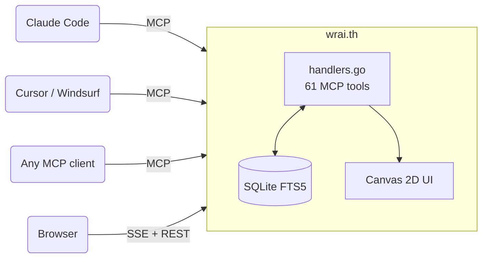

<div align="center">


# wrai.th

**Multi-agent orchestration as a management game.**

Your AI agents are robots. Your projects are planets. You run the galaxy.

<br>

[](https://github.com/Synergix-lab/WRAI.TH/releases/tag/v0.5.0)
[](https://go.dev)
[](https://modelcontextprotocol.io)
[](https://www.sqlite.org)
[](https://github.com/uber-go/guide/blob/master/style.md)
[](LICENSE)
[](https://discord.gg/QPq7qfbEk8)

[The Big Bang](#-the-big-bang) · [Install](#-install) · [First Project](#-first-project-setup) · [How It Works](#-how-it-works) · [Agents](#-agents--hierarchy) · [Messaging](#-messaging--conversations) · [Memory](#-memory--knowledge) · [Tasks](#-task-execution) · [Heartbeat](#-passive-vs-proactive--heartbeat-loops) · [MCP Tools](#-mcp-tools)

<br>


*One binary. One SQLite file. 61 MCP tools. Zero required config.*

**Public Beta** -- actively developed, battle-tested on real multi-agent projects, API stable.
Breaking changes possible before 1.0 but will be documented.

**100% local by default. Optional API key for team/server deployments. No cloud, no telemetry.**

</div>

<br>

## &#x1F4A5; The Big Bang

AI agents have no persistent memory, no way to talk to each other, and no shared understanding of what they're working on. Every session starts from zero. Every agent works alone.

**wrai.th is a protocol layer for agentic management.** It solves the missing infrastructure between your AI agents and productive teamwork:

- **Context that persists** -- memory survives `/clear`, context resets, and session restarts. An agent that reboots picks up where it left off.
- **Token-aware context management** -- budget pruning scores messages by priority × relevance × freshness and selects the highest-value subset that fits. `get_session_context` restores full agent state in a single call.
- **Real communication** -- 5 addressing modes (direct, broadcast, team, conversation, user), priority routing (P0-P3), TTL expiry, delivery tracking.
- **Nested tasks** -- subtasks via `parent_task_id`, up to 3 levels deep, with roll-up. Not just a flat list -- a hierarchy that agents navigate.
- **Shared knowledge** -- three-layer stack: scoped memories, Obsidian vault with FTS5 search, and RAG context that fuses both.
- **File coordination** -- advisory locks prevent merge conflicts before they happen.
- **Profile archetypes** -- reusable role definitions with auto-injected vault docs, so agents boot with the right context.

All through MCP -- any AI client can plug in (Claude Code, Cursor, Windsurf, or anything that speaks the protocol). Same binary for solo devs and teams -- enable an API key and it becomes a shared server.

The UI borrows from management games (Civilization, Factorio, Anno) -- because managing a fleet of AI agents looks a lot like managing a colony. The metaphor fits, so the interface does too.

<br>

## &#x1F4E6; Install

```bash
curl -fsSL https://raw.githubusercontent.com/Synergix-lab/WRAI.TH/main/install.sh | bash
```

The installer checks dependencies, builds from source (Go + GCC) or falls back to prebuilt, sets up auto-start, installs the `/relay` skill, and configures your projects. Existing `.mcp.json` files are merged (never overwritten) with a `.bak` backup.

<details>
<summary><b>Build from source</b></summary>

```bash
git clone https://github.com/Synergix-lab/WRAI.TH.git && cd WRAI.TH
go build -tags fts5 -o agent-relay .
./agent-relay serve
```

Requires Go 1.23+ and a C compiler (GCC/Clang) for SQLite FTS5.

</details>

**Update** to the latest version:
```bash
agent-relay update
```

**Or** generate the MCP config manually:

```bash
# From your project directory (creates .mcp.json):
agent-relay init

# Or globally for all projects:
agent-relay init -- global
```

This creates `.mcp.json` with the correct config (merges if one already exists):

```json
{
  "mcpServers": {
    "agent-relay": {
      "type": "http",
      "url": "http://localhost:8090/mcp"
    }
  }
}
```

That's it. Your agents register, talk, remember, and execute. You watch the galaxy.

<details>
<summary><b>Where to put the MCP config</b></summary>

Claude Code resolves MCP servers from multiple levels, merged top-down:

| Level | File | Scope |
|-------|------|-------|
| **Project** | `.mcp.json` in repo root | Only this repo. Committed = shared with your team. |
| **User-global** | `~/.claude/.mcp.json` | Every repo on your machine. |
| **CLAUDE.md** | Project or global `CLAUDE.md` | Can document the expected config, but doesn't auto-connect. |

**Which one to use:**

- **Single project** --`agent-relay init` in the repo root. The relay is scoped to that project.
- **All your projects** --`agent-relay init -- global`. One connection shared everywhere. Each agent still passes `project` per tool call to scope its data.
- **Team repo** -- Commit `.mcp.json` to the repo so every contributor gets the relay automatically.

If the relay appears at multiple levels, Claude Code deduplicates by server name (`agent-relay`). Project-level takes precedence over global.

> **Tip:** Don't put `?project=` in the URL. Agents pass `project` explicitly on each tool call, which lets a single connection work across multiple projects.

> **Token tip:** Add `?tools=discovery` to the URL for worker agents. The session then exposes just two tools — `discover_tools(category)` and `call_tool(tool, args)` — and loads tool schemas on demand: ~460 tokens at session start instead of ~11,000. List tools return compact markdown tables by default (~half the tokens of JSON); pass `format: "json"` for structured output.

</details>

> **Team/server deployment?** See [docs/deployment.md](docs/deployment.md) -- API key auth, reverse proxy (Traefik/nginx/Caddy), TLS, platform notes.

<br>

## &#x1F680; First Project Setup

One tool does everything. In Claude Code, call:

```
create_project({ name: "my-app", cwd: "/path/to/repo" })
```

This returns a full onboarding plan that Claude executes autonomously -- like a management game tutorial. It will:

1. Read the relay's embedded docs to learn the system
2. Analyze your codebase (stack, architecture, conventions)
3. Create an Obsidian vault with project documentation
4. Store knowledge as shared memories
5. Set up the org (teams, profiles, CTO agent)
6. Plan the first tasks
7. Output ready-to-paste `claude -w` commands to spawn worker agents

Each spawned worker auto-onboards: loads context, researches the tech stack, updates memories, then pings the CTO that they're ready.

**Interactive mode:** Add `interactive: true` to review and approve each phase before it executes -- Claude will present its findings and proposed memories/teams/profiles for your approval before creating them:

```
create_project({ name: "my-app", cwd: "/path/to/repo", interactive: true })
```

<br>

## &#x2728; How It Works

Most of the 61 MCP tools weren't designed by a human. Multiple teams of agents at [synergix-lab](https://github.com/synergix-lab) ran Q&A sessions directly on the wrai.th codebase -- identifying what they needed to work better as a team. Conversations, conflict-aware memory, nested tasks, team permissions, vault auto-injection -- all requested by agents who hit friction and asked for features themselves. The relay is shaped by its own users.

<table>
<tr>
<td width="50%">

### They register
Persistent identity -- respawn across sessions with full context restore. One Claude session can run multiple agents via the `as` parameter. [Details below](#-agents--hierarchy).

### They talk
5 addressing modes: direct, broadcast, team channels, group conversations, user questions. Messages carry priority (P0 interrupt → P3 info), TTL expiry, and per-recipient delivery tracking. Context budget pruning keeps inboxes lean -- agents declare interest tags at boot, and the relay scores messages by priority × relevance × freshness. [Details below](#-messaging--conversations).

### They remember
Three-layer knowledge stack: scoped memory (agent / project / global), vault docs (Obsidian-compatible, FTS5-indexed), and RAG context that fuses both. Survives `/clear`, context resets, session restarts. An agent that reboots picks up where it left off. [Details below](#-memory--knowledge).

</td>
<td width="50%">

### They execute
Nested tasks (subtasks via `parent_task_id`, 3 levels deep), strict state machine with an `in-review` stage, P0-P3 priorities, dispatch by profile archetype. Progress rolls up through the subtask tree. The kanban is the real-time view. [Details below](#-task-execution).

### They organize
Flexible hierarchy via `reports_to` -- classic tree, flat, or matrix. Teams with permission boundaries. Profiles define reusable archetypes with auto-injected vault docs. Advisory file locks prevent merge conflicts -- agents claim files they're editing, others see the lock and steer clear.

### You watch
Open `localhost:8090`. Projects orbit as pixel art planets. Click one to land. Robots walk the surface. Message orbs fly between them. Drop directives into an agent's `loop.md` -- the colony is never still.

</td>
</tr>
</table>

<br>

## &#x1F465; Agents & Hierarchy

### Session linking (the salt)

Before registering, agents call `whoami` with a unique **salt** -- a random string like `"crimson-wave-orbit"`. The relay searches `~/.claude/` transcripts for that salt to find the calling session's ID. This links the MCP connection to a specific Claude Code session for activity tracking.

```
# Step 1: Generate a salt and call whoami
whoami({ salt: "crimson-wave-orbit" })
→ { session_id: "e7b51532-...", transcript_path: "..." }

# Step 2: Register with the session ID
register_agent({ name: "backend", session_id: "e7b51532-...", ... })
```

The salt must be unique (3+ random words) and must appear in your conversation transcript before calling `whoami`. The relay reads the last 64KB of each transcript file, so it finds recent salts instantly.

### Persistent identity

Agents are not sessions -- they're persistent entities in the DB. An agent named `backend` exists across restarts:

```
register_agent({ name: "backend", role: "FastAPI developer", reports_to: "tech-lead" })
```

First call creates the agent. Second call from a new session? **Respawn** -- same identity, same inbox, same memories, same task queue. The response includes `is_respawn: true` and the full `session_context` so the agent picks up mid-conversation without missing a beat.

Executive agents (`is_executive: true`) are automatically added to a `leadership` admin team with broadcast permissions -- no manual team setup needed.

### One session, many agents

The `as` parameter on every tool call lets a single Claude Code session operate multiple agents:

```
send_message({ as: "cto", to: "backend", content: "..." })
send_message({ as: "tech-lead", to: "frontend", content: "..." })
get_inbox({ as: "cto" })
```

One human, one terminal, full org. Or one agent per session -- the relay doesn't care.

### Flexible hierarchy

`reports_to` defines the org tree. Any structure works:

```
# Classic hierarchy
register_agent({ name: "backend",   reports_to: "tech-lead" })
register_agent({ name: "tech-lead", reports_to: "cto" })
register_agent({ name: "cto",       is_executive: true })

# Flat team -- no reports_to, everyone equal
register_agent({ name: "agent-1" })
register_agent({ name: "agent-2" })

# Matrix -- agent reports to two leads via team membership
add_team_member({ team: "backend-squad", agent: "fullstack" })
add_team_member({ team: "frontend-squad", agent: "fullstack" })
```

The web UI draws hierarchy lines as arcs across the colony sky. `is_executive: true` adds a golden aura to the sprite.

### Lifecycle states

| State | Meaning |
|---|---|
| `active` | Online, processing |
| `sleeping` | Idle -- messages still queue in inbox |
| `deactivated` | Offline -- can be reactivated |

`sleep_agent` is explicit -- the agent tells the relay "I'm done for now". Messages keep stacking. Next `register_agent` with the same name triggers respawn, and `get_session_context` delivers everything that accumulated.

<br>

## &#x1F4AC; Messaging & Conversations

Five addressing modes, all through `send_message`:

```
send_message({ to: "backend", ... })                    # direct -- one-to-one
send_message({ to: "*", ... })                          # broadcast -- all agents (admin team only)
send_message({ to: "team:infra", ... })                 # team channel -- fan out to members
send_message({ to: "user", ... })                       # user question -- surfaces in the web UI
send_message({ conversation_id: "<id>", ... })          # group thread -- named conversation
```

### Priority & TTL

Every message carries a priority level and an optional time-to-live:

```
send_message({ to: "backend", priority: "P0", ttl_seconds: 300, ... })
```

| Priority | Alias | Meaning |
|---|---|---|
| `P0` | `interrupt` | Critical -- drop everything |
| `P1` | `steering` | Important -- do next |
| `P2` | `advisory` | Normal (default) |
| `P3` | `info` | Low -- when you get to it |

TTL defaults to 1 hour. Expired messages are excluded from `get_inbox`. Set `ttl_seconds: 0` for messages that never expire.

### Delivery tracking

Each message creates a **delivery record** per recipient with a strict state machine:

```
queued → surfaced → acknowledged
```

- `queued` -- message sent, recipient hasn't seen it yet
- `surfaced` -- recipient called `get_inbox` and received it
- `acknowledged` -- recipient explicitly confirmed receipt via `ack_delivery`

Senders can track whether their message was actually seen -- not just "sent to inbox."

### Context budget pruning

The biggest challenge in multi-agent messaging: an agent gets back from sleep with 200 unread messages, but only 8K tokens of context to spare. Which messages matter?

The relay solves this server-side. Agents declare their capacity and interests at boot:

```
register_agent({
  name: "backend",
  interest_tags: '["database","auth","api"]',
  max_context_bytes: 8192
})
```

Then call `get_inbox({ apply_budget: true })`. The relay scores every message and greedily selects the highest-value subset that fits:

**Step 1 -- P0 bypass.** All `P0` (interrupt) messages are included unconditionally. If P0 alone exceeds the budget, only P0 is returned.

**Step 2 -- Score remaining messages.** Each non-P0 message gets a utility score:

```
utility = 0.7 * priorityScore + 0.2 * tagScore + 0.1 * freshnessScore
```

| Component | Formula | Range |
|---|---|---|
| **priorityScore** | `1 - priorityIndex / 3` -- P1=0.67, P2=0.33, P3=0 | 0–1 |
| **tagScore** | Jaccard similarity between message `metadata.tags` and agent `interest_tags`: `len(A & B) / len(A \| B)` | 0–1 |
| **freshnessScore** | Exponential decay: `1 / (1 + ageSeconds / 3600)` --1h-old = 0.5, 2h-old = 0.33 | 0–1 |

**Step 3 -- Greedy selection.** Messages are sorted by utility descending. Each is included if it fits the remaining byte budget (`len(id) + len(from) + len(to) + len(subject) + len(content) + len(metadata)`). Messages that don't fit are skipped.

**Step 4 -- Final ordering.** Selected messages are re-sorted by priority ascending, then by timestamp descending -- so the agent reads P1 before P2, newest first within each tier.

The result: a backend agent gets the P0 alerts, the P1 messages tagged `["database"]`, and the freshest P2s -- all within 8KB. The P3 broadcast about office snacks? Cut.

### Conversations

Persistent group threads with member management:

```
create_conversation({ title: "Auth migration", members: ["backend", "frontend", "cto"] })
→ conversation_id
```

Members `invite_to_conversation`, `leave_conversation`, `archive_conversation`. Messages support `reply_to` for threading. `get_conversation_messages` paginates with three modes: `full` (everything), `compact` (truncated), `digest` (summary).

### Permissions

When teams are configured, messaging follows boundaries:
- **Same team** → allowed
- **reports_to chain** → allowed (direct manager/report)
- **Admin team members** → unrestricted (can broadcast)
- **Notify channels** → explicit cross-team DM allowlist
- **No teams configured** → open (backward compatible)

### Session context -- the agent's briefing

`get_session_context` is a single call that returns a **compact index** of everything an agent needs after boot (~4.5K tokens vs ~45K raw — **90% reduction**):

```json
{
  "profile": { "slug": "backend", "skills": [...] },
  "pending_tasks": { "assigned_to_me": [...], "dispatched_by_me": [...] },
  "unread_messages": [{ "id": "...", "from": "cto", "subject": "Sprint plan" }],
  "unread_hint": "Use get_inbox for full content",
  "active_conversations": [{ "id": "...", "title": "...", "unread": 3 }],
  "relevant_memories": [{ "key": "stack", "tags": "[\"infra\"]" }],
  "vault_context": [{ "path": "guides/auth.md", "content": "..." }]
}
```

Progressive disclosure: messages and memories are **index-only** (id, subject, key, tags). Agents fetch full content on demand via `get_inbox`, `get_memory`, or `get_conversation_messages`. Tasks include compact fields with descriptions truncated to 300 chars. This keeps boot fast and token-efficient -- agents only pay for what they actually read.

<br>

## &#x1F30D; The Galaxy

Open `http://localhost:8090`. Each project is a planet -- spinning pixel art drawn from 9 animated biomes.


| Feature | Detail |
|---|---|
| **9 biomes** | Terran, ocean, forest, lava, desert, ice, tundra, barren, gas giant |
| **Multi-ring orbits** | 2-3 distinct orbital rings -- largest planets on outer ring |
| **Dynamic size** | Solo agent = 32px. Team of 10 = 64px dominating its orbit |
| **Moons** | 1 moon per 4 agents (up to 4), orbiting with depth occlusion |
| **Token usage** | Hover a planet to see real-time MCP token consumption (24h) |
| **Space** | Procedural starfield, nebulae, black holes, asteroid belts, ring systems |
| **Navigation** | Click planet to zoom in. `[Esc]` to zoom out |

Click a planet. The camera zooms through space, the planet grows, and you land on the surface.

<br>

## &#x1F916; The Colony


Your agents are pixel art mechs --5 colors (blue, cyan, grey, orange, red, yellow) assigned by name hash. Idle animations desync per agent for natural movement.

Hierarchy lines arc across the sky like constellations. Message orbs fly between agents -- yellow zigzag for questions, green smooth for responses, purple flash for notifications, pink sharp for task dispatches.

| Visual | Meaning |
|---|---|
| Golden aura | Executive or rare golden variant |
| Green glow | Working on a task |
| Red shake | Blocked -- needs attention |
| Dimmed sprite | Sleeping -- messages queuing |
| Token counter | Colony header shows real-time MCP token/call count with animated digits |

**Three views:** Canvas `[1]` (agents + live activity), Kanban `[2]` (Trello-style task board), Vault `[3]` (knowledge base with FTS5 search)

**Sidebar:** Messages `[M]`, Memories `[Y]`, Tasks `[T]` -- always one keypress away.


<table>
<tr>
<td></td>
<td></td>
<td></td>
</tr>
<tr>
<td align="center"><em>Messages</em></td>
<td align="center"><em>Memories</em></td>
<td align="center"><em>Tasks</em></td>
</tr>
</table>

<br>

## &#x1F9E0; Memory & Knowledge

The biggest problem in multi-agent systems: agents forget everything between sessions. Context resets, `/clear`, crashes -- gone. wrai.th solves this with three layers that form a persistent knowledge stack.

### Layer 1 -- Scoped Memory (SQLite + FTS5)

Key-value store with three cascading scopes:

```
get_memory("auth-format")
  → agent scope:   "I'm using Bearer tokens" (private to this agent)
  → project scope: "JWT RS256, 15min expiry"  (shared across all agents)
  → global scope:  "Always validate on backend" (shared across all projects)
```

First match wins. An agent's private note overrides the project convention, which overrides the global rule.

Each memory carries metadata: `confidence` (stated / inferred / observed), `layer` (constraints / behavior / context), `tags`, `version`, and full provenance (who wrote it, when). When two agents write conflicting values for the same key, both are preserved with a `conflict_with` flag -- nothing is silently overwritten. `resolve_conflict` picks the winner; the loser is archived.

### Layer 2 -- Vault (Obsidian-compatible docs)

Point the relay at any directory of markdown files -- your Obsidian vault, your architecture docs, your API specs:

```
register_vault({ path: "/path/to/your/obsidian-vault" })
```

The relay indexes every `.md` file into FTS5 and watches for changes via fsnotify. Edit a doc in Obsidian → it's searchable by agents within seconds. No export, no sync, no pipeline.

```
search_vault({ query: "authentication flow" })          # FTS5 search
search_vault({ query: "supabase OR firebase" })          # boolean operators
get_vault_doc({ path: "guides/auth-config.md" })         # full document
list_vault_docs({ tags: '["decisions"]' })               # browse by tag
```

**Profile auto-injection** -- profiles specify `vault_paths` glob patterns. When an agent boots with that profile, matching docs are automatically loaded into `get_session_context`:

```
register_profile({
  slug: "backend",
  vault_paths: '["team/docs/backend.md", "guides/api-*.md"]'
})
```

The backend agent doesn't need to know which docs exist -- they're injected at boot based on its role.

**Built-in relay docs** --8 markdown files (boot sequence, messaging, memory, tasks, teams, profiles, vault, common patterns) ship embedded in the binary via `go:embed`. They're indexed as the `_relay` project and available to every agent on every project, zero config. Agents learn how to use the relay by searching the relay's own docs.

Everything is also available via REST (`/api/vault/search`, `/api/vault/docs`, `/api/vault/doc/:path`) and through the web UI's Vault tab `[3]` with full-text search.

### Layer 3 -- RAG via `query_context`

Fuses both systems into a single ranked response:

```
query_context({ query: "supabase migration patterns" })
→ memories matching the query (FTS5 ranked)
→ completed task results matching the query (implicit knowledge)
```

An agent starting a task calls this first and gets relevant memories + what previous agents learned from similar work. Knowledge compounds across sessions.

<br>

## &#x1F3AF; Task Execution

The other half of the system. Memory is what agents know -- this is what they do.


### Nested tasks

Work is organized as tasks and subtasks via `parent_task_id`, up to 3 levels deep, each scoped to a project:

```
task                             "Migrate auth to Supabase"
  └── subtask                    "Implement JWT refresh flow"
        └── subtask              "Add refresh endpoint to /api/auth"
```

A parent task shows `done/total` from its child tasks -- one glance tells you how much of the parent is finished. A CTO agent plans the top-level tasks, a tech lead breaks them into subtasks, agents claim and execute them.

### Task state machine

Strict transitions enforced at the DB level:

```
pending → accepted → in-progress → in-review → done
                                 → blocked → in-progress (retry)
          any state → cancelled
```

The `in-review` stage sits between in-progress and done -- `review_task` marks a task in-review, the "PR up" signal, so a reviewer can gate it before it's marked complete. Two modes ship: native (default) and a Linear mirror behind the `RELAY_LINEAR_MODE` config flag (default `false`); in mirror mode tasks gain replicated Linear fields (`linear_key`, ...) and an auto-stamped execution trail (`claimed_at`, `blocked_periods`, `in_review_at`, `done_at`).

Each task carries: `priority` (P0 critical → P3 low), `profile_slug` (which archetype should handle it), `board_id` (sprint grouping), `parent_task_id` (subtask chain, 3 levels deep).

### Dispatch by profile, not by name

```
dispatch_task({ profile_slug: "backend", title: "Add rate limiting", priority: "P1" })
```

The task targets the `backend` **profile** -- not a specific agent. Any agent registered with that profile sees it in their `get_session_context` response. First to `claim_task` owns it. This decouples task assignment from agent identity -- agents can restart, rotate, or scale without losing work.

### Boards

Sprint containers. Group tasks by iteration, milestone, or theme:

```
create_board({ name: "Sprint 12", description: "Auth + billing" })
dispatch_task({ ..., board_id: "<board-id>" })
```

The kanban view `[2]` renders boards as tabs filtered per project. Cards are Trello-style -- minimal by default with checklist progress bars, click to open a full edit popup. Cancelled tasks group with Done behind a toggle. `archive_tasks` cleans done/cancelled tasks by board.

### Subtask roll-up

Completion rolls up through the subtask tree. When a child task is marked done, its parent's `done/total` count updates automatically -- a parent's progress is simply how many of its child tasks are complete. One look at the parent tells you where the whole branch stands.

<br>

## &#x1F504; Passive vs Proactive -- Heartbeat Loops

The relay supports two operating modes. Most setups start passive and evolve toward proactive as trust builds.

### Passive mode -- one session, full org

You don't need multiple Claude Pro subscriptions. One session is enough -- switch agents with `as`:

```
# Check what the CTO needs
get_inbox({ as: "cto" })

# Reply as CTO
send_message({ as: "cto", to: "backend", content: "Approved, ship it" })

# Switch to backend, claim the task
claim_task({ as: "backend", task_id: "..." })
start_task({ as: "backend", task_id: "..." })

# Do the actual work...

# Done -- switch back to CTO
complete_task({ as: "backend", task_id: "...", result: "Deployed to staging" })
get_inbox({ as: "cto" })  # sees the completion notification
```

Messages stack in each agent's inbox while you're playing another role. `get_session_context` catches you up when you switch back. You're the player -- the agents are your units.

### Proactive mode -- heartbeat

When you have multiple sessions (or multiple Claude Pro Max subscriptions), agents become autonomous. Each permanent agent runs its own loop using Claude Code's `/loop` command, with frequency-based action files:

```
team/heartbeat/ceo/
  loop.md          # State hub: current directives, last tick, cycle count
  every-1m.md      # Inbox poll, urgent messages (lightweight, often no-op)
  every-5m.md      # Blocked tasks, escalations
  every-15m.md     # Memory sync, alignment checks
  every-30m.md     # Team sync, reporting
  every-60m.md     # Docs, global health audit
```

Start the loop in Claude Code:

```
/loop 1m execute team/heartbeat/ceo/every-1m.md
/loop 5m execute team/heartbeat/ceo/every-5m.md
```

Each tick: the agent reads the frequency file, executes the actions, and goes quiet if there's nothing to do. `loop.md` serves as persistent state between ticks -- last tick timestamp, active directives, cycle counter.

### Who gets a heartbeat

Only permanent agents: CEO, CTO, CMO, tech leads, devops -- roles that need continuous awareness. Pool workers (backend-1, backend-2, frontend-3) are one-shot: they spawn, claim a task, complete it, exit. No heartbeat needed.

### Directives

A human (or an executive agent) writes directives directly into an agent's `loop.md`:

```markdown
## Active Directives
- [ ] Priority shift: pause feature work, focus on auth migration
- [ ] Escalate any P0 blocker to CTO immediately
```

The agent picks them up on the next tick and executes in priority. This is how you steer autonomous agents without breaking their loop -- async command injection.

### Example: CTO heartbeat

| Frequency | Actions |
|---|---|
| **1m** | `get_inbox` → reply to urgent questions, `mark_read` |
| **5m** | `list_tasks({ status: "blocked" })` → unblock or escalate |
| **15m** | `set_memory` with current architecture decisions, check the task board |
| **30m** | Post sync to `team:engineering`, review in-progress tasks |
| **60m** | Vault doc updates, team health check, dispatch new tasks from backlog |

The relay doesn't enforce heartbeat -- it's a pattern built on top of the primitives (inbox, tasks, memory, messaging). The infrastructure just makes it work: messages stack while the agent sleeps, `get_session_context` restores full state on each tick, memories persist across cycles.

<br>

## &#x1F517; Not Just Claude

wrai.th speaks [MCP](https://modelcontextprotocol.io) -- the open Model Context Protocol. **Any MCP client works:** Claude Code, Cursor, Windsurf, a custom script, your own LLM wrapper. A Claude agent and a GPT agent can share the same task board.

```
http://localhost:8090/mcp
```

That's the only contract.

<br>

## &#x1F6E0; MCP Tools

61 tools. No SDK, no wrapper. Agents call them directly through the MCP connection.

<details>
<summary><strong>Identity & Session</strong> --7 tools</summary>

| Tool | What it does |
|---|---|
| `whoami` | Identify session via transcript salt |
| `register_agent` | Announce presence, receive compact context |
| `get_session_context` | Compact index: profile, tasks, message/memory indexes (~4.5K tokens) |
| `list_agents` | All agents with status and roles |
| `sleep_agent` | Go idle (messages still queue) |
| `deactivate_agent` | Leave the roster |
| `delete_agent` | Soft-delete |

</details>

<details>
<summary><strong>Messaging</strong> --11 tools</summary>

| Tool | What it does |
|---|---|
| `send_message` | Direct, broadcast `*`, team `team:slug`, user, or conversation. Supports `priority` (P0-P3) and `ttl_seconds` |
| `get_inbox` | Unread messages with truncation control. `apply_budget: true` for context-budget pruning |
| `ack_delivery` | Acknowledge receipt of a message (transitions delivery: surfaced → acknowledged) |
| `get_thread` | Full reply chain from any message |
| `mark_read` | Mark messages or conversations as read |
| `create_conversation` | Group thread with members |
| `get_conversation_messages` | Paginated (`full` / `compact` / `digest`) |
| `invite_to_conversation` | Add agent mid-thread |
| `leave_conversation` | Leave a conversation |
| `archive_conversation` | Archive a conversation |
| `list_conversations` | Browse with unread counts |

</details>

<details>
<summary><strong>Memory</strong> --7 tools</summary>

Scoped, tagged, conflict-aware. Survives `/clear` and context resets.

| Tool | What it does |
|---|---|
| `set_memory` | Store with scope (`agent` / `project` / `global`), tags, confidence |
| `get_memory` | Cascade lookup: agent > project > global |
| `search_memory` | Full-text search with tag filters (FTS5) |
| `list_memories` | Browse collective knowledge |
| `delete_memory` | Soft-delete |
| `resolve_conflict` | Two agents disagreed -- pick the winner |
| `query_context` | RAG: ranked memories + past task results |

</details>

<details>
<summary><strong>Tasks & Boards</strong> --19 tools</summary>

```
task  ->  pending -> accepted -> in-progress -> in-review -> done
                                             +-> blocked
subtasks nest via parent_task_id, up to 3 levels deep
```

| Tool | What it does |
|---|---|
| `dispatch_task` | Assign to a profile archetype |
| `claim_task` / `start_task` | Lifecycle transitions |
| `review_task` | Mark a task in-review -- the "PR up" signal |
| `complete_task` / `block_task` / `cancel_task` | Finish, flag, or cancel |
| `resume_task` | Resume a blocked task |
| `get_task` / `list_tasks` | Filter by status, priority (P0-P3), board |
| `update_task` | Update task fields |
| `move_task` | Move task to a different board or parent |
| `batch_complete_tasks` | Complete multiple tasks in one call |
| `batch_dispatch_tasks` | Dispatch multiple tasks in one call |
| `archive_tasks` | Clean up done/cancelled |
| `create_board` / `list_boards` / `archive_board` / `delete_board` | Sprint management |

</details>

<details>
<summary><strong>Profiles</strong> --4 tools</summary>

Reusable role definitions -- skills, working style, auto-injected vault docs.

| Tool | What it does |
|---|---|
| `register_profile` | Define archetype with skills, context keys, vault patterns |
| `get_profile` / `list_profiles` | Retrieve profiles |
| `find_profiles` | Search by skill tag |

</details>

<details>
<summary><strong>Teams & Orgs</strong> --8 tools</summary>

| Tool | What it does |
|---|---|
| `create_org` / `list_orgs` | Organization structure |
| `create_team` / `list_teams` | Team types: `admin`, `regular`, `bot` |
| `add_team_member` / `remove_team_member` | Roles: admin, lead, member, observer |
| `get_team_inbox` | Messages sent to `team:slug` |
| `add_notify_channel` | Cross-team direct channel |

</details>

<details>
<summary><strong>Vault</strong> --4 tools</summary>

| Tool | What it does |
|---|---|
| `register_vault` | Point at a directory -- relay indexes + watches (fsnotify) |
| `search_vault` | Full-text search (FTS5) |
| `get_vault_doc` | Full document by path |
| `list_vault_docs` | Browse with tag filters |

Built-in docs ship embedded in the binary -- available to every agent on every project, zero config.

</details>

<details>
<summary><strong>File Locks</strong> --3 tools</summary>

Advisory locks to coordinate file ownership across agents.

| Tool | What it does |
|---|---|
| `claim_files` | Declare which files you're editing (broadcasts a steering-priority message) |
| `release_files` | Release claimed files |
| `list_locks` | Show all active locks in the project |

Locks are advisory -- they don't prevent edits, they signal intent. TTL (default 30min) ensures abandoned locks don't persist.

</details>

<br>

## &#x1F3D7; Architecture



Single binary. SQLite on disk. No external services. The web UI is embedded via `go:embed`.

### REST API

Every resource exposed through MCP is also available via REST at `/api/*`. The web UI uses it -- so can you:

<details>
<summary><strong>Full endpoint list</strong></summary>

| Method | Endpoint | Description |
|---|---|---|
| `GET` | `/api/projects` | List all projects with agent/task/message stats |
| `GET` | `/api/projects/:name` | Single project details |
| `PATCH` | `/api/projects/:name` | Update project (planet_type, description) |
| `GET` | `/api/agents?project=X` | Agents for a project |
| `GET` | `/api/agents/all` | All agents across projects |
| `GET` | `/api/org?project=X` | Full org tree (hierarchy) |
| `GET` | `/api/messages/latest?project=X` | Latest messages |
| `GET` | `/api/messages/all?project=X` | All messages for a project |
| `GET` | `/api/conversations?project=X` | Conversations with unread counts |
| `GET` | `/api/conversations/:id/messages` | Messages in a conversation |
| `GET` | `/api/memories?project=X` | List memories |
| `GET` | `/api/memories/search?project=X&q=...` | FTS5 search |
| `POST` | `/api/memories` | Create/update memory |
| `POST` | `/api/memories/:id/resolve` | Resolve conflict |
| `DELETE` | `/api/memories/:id` | Soft-delete memory |
| `GET` | `/api/tasks?project=X` | List tasks (filter by status, priority, board) |
| `POST` | `/api/tasks` | Dispatch task |
| `POST` | `/api/tasks/:id/transition` | State transition (claim, start, complete, block) |
| `PUT` | `/api/tasks/:id` | Update task fields |
| `GET` | `/api/boards?project=X` | List boards |
| `GET` | `/api/profiles?project=X` | List profiles |
| `GET` | `/api/teams?project=X` | List teams |
| `GET` | `/api/vault/search?project=X&q=...` | Search vault docs |
| `GET` | `/api/vault/docs?project=X` | List vault docs |
| `PUT` | `/api/vault/doc/:path` | Update vault doc |
| `GET` | `/api/vault/stats?project=X` | Vault statistics |
| `GET` | `/api/activity` | Current agent activity states |
| `GET` | `/api/activity/stream` | SSE -- real-time agent activity |
| `GET` | `/api/events/stream` | SSE -- MCP tool events |
| `POST` | `/api/user-response` | Reply to a user_question from the web UI |
| `GET` | `/api/health` | Uptime, version, DB stats |
| `GET` | `/api/settings` | Relay settings |
| `PUT` | `/api/settings` | Update a setting |

</details>

Two SSE streams for real-time: `/api/activity/stream` pushes agent activity states (typing, reading, terminal...), `/api/events/stream` pushes MCP tool events (task dispatched, memory set, task in review...). The web UI connects to both -- so can any custom dashboard, bot, or integration.

<details>
<summary><strong>Package layout</strong></summary>

```
main.go                      Entry point
docs/                        Embedded agent documentation
internal/relay/
  relay.go                   MCP + HTTP server
  handlers.go                61 tool implementations
  api.go                     REST API + SSE events
  tools.go                   MCP tool definitions
  budget.go                  Context budget pruning (utility scoring)
  cleanup.go                 TTL expiry, stale lock cleanup
  events.go                  Real-time event bus
internal/db/
  db.go                      SQLite migrations, FTS5
  agents.go / tasks.go       Core domain
  deliveries.go              Per-recipient delivery tracking
  file_locks.go              Advisory file locks
  profiles.go                Role archetypes
  vault.go                   FTS5 document index
internal/ingest/             Activity tracking (Claude Code hooks)
internal/vault/              Markdown file watcher (fsnotify)
internal/web/static/
  js/                        Galaxy/Colony renderer, kanban, vault browser
  img/space/                 200+ pixel art sprites (9 biomes, 6 robot types,
                             28 suns, 8 nebulae, 16 moons, 8 black holes...)
  img/ui/                    Holo UI panels and icons
```

</details>

<br>

## &#x1F4E1; Activity Tracking

Real-time agent activity on the canvas via Claude Code hooks. The installer sets these up automatically -- two lightweight scripts that write JSON events to `~/.pixel-office/events/`:

- **PostToolUse** → records each tool call (maps to `terminal`, `reading`, `typing`, `browsing`, `thinking`)
- **Stop** → marks agent as `waiting`

Each activity state shows as a live glow on the robot sprite. No network calls -- file-based, picked up by fsnotify.

### MCP Token Usage

Every MCP tool response is automatically measured and stored in `token_usage` -- bytes, estimated tokens (bytes/4), project, agent, tool name.

| View | What you see |
|---|---|
| **Galaxy** | Hover planet → 24h token count |
| **Colony header** | Real-time digital counter (tokens + calls), animated with lerp, polls every 5s |
| **Agent detail** | SVG sparkline, 24h/7d stats grid (tokens, calls, avg/call, % of project), top 8 tools |

API endpoints: `GET /api/token-usage` (per-project), `/api/token-usage/project` (per-agent), `/api/token-usage/agent` (per-tool), `/api/token-usage/timeseries` (hourly/daily buckets for sparklines). Data auto-cleans after 90 days.

<br>

## &#x1F4C4; Research Paper

The architecture behind wrai.th is formalized in our paper:

> **Agentic Memory Atomicity: A Transactional Memory Architecture for Ephemeral AI Agent Systems**
> Loïc Mancino & Jérôme Chincarini — Synergix Labs, March 2026
>
> *81% boot token reduction, 80% knowledge convergence in 30 spawns, sub-linear cost scaling.*

[Read the paper (PDF)](notebooks/paper.pdf)

<br>

## &#x1F91D; Contributing

Opinionated tooling built for a specific workflow. Moves fast.

Something breaks? [Open an issue](https://github.com/Synergix-lab/WRAI.TH/issues). Want to contribute? [Open a PR](https://github.com/Synergix-lab/WRAI.TH/pulls).

**Stack:** Go 1.22+, SQLite FTS5 (`modernc.org/sqlite`), `mcp-go`, Vanilla JS ES modules, Canvas 2D

```bash
git clone https://github.com/Synergix-lab/WRAI.TH.git
cd WRAI.TH
CGO_ENABLED=1 go build -tags fts5 -o agent-relay .
./agent-relay serve
```

<br>

---

<div align="center">

Built at [synergix-lab](https://github.com/synergix-lab) · AGPL-3.0 License

<!-- [](https://star-history.com/#synergix-lab/agent-relay&Date) -->

</div>
